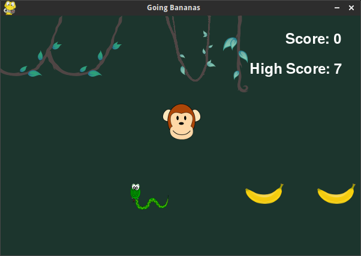

# Going Bananas
Project #1 for CSCI 1310 at CU Boulder

Going Bananas is a simple game with an objective of the collecting as many bananas as possible. The user (monkey) must jump over the incoming snakes, while still spending as much time as possible on the ground to collect bananas. The game ends when the user comes into contact with a snake. The game features a high score tracking system, using a highScore.txt file that is written to at the end of the game if the user surpassed the high score. 

# To Run
1. Make sure pygame is installed
2. `python goingBananas.py` (Python 2.7)

# Controls
- Spacebar \- Jump
- Left Arrow Key \- Move Left
- Right Arrow Key \- Move Right

